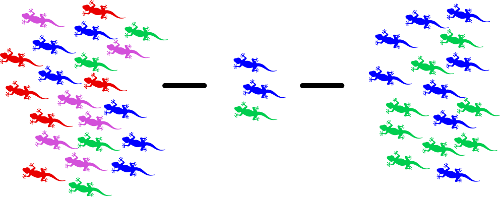
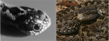
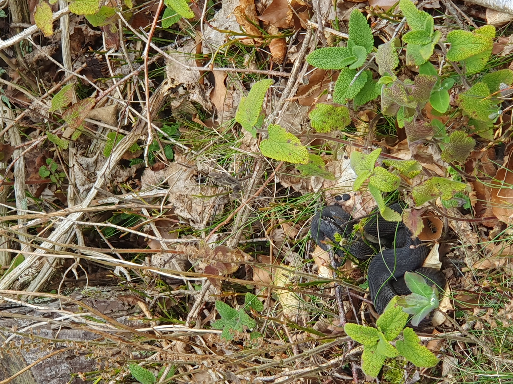
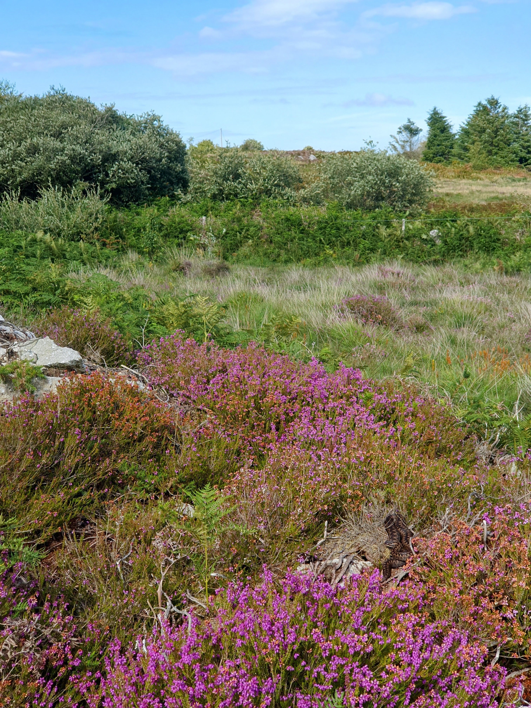
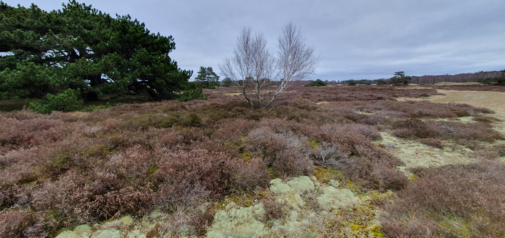
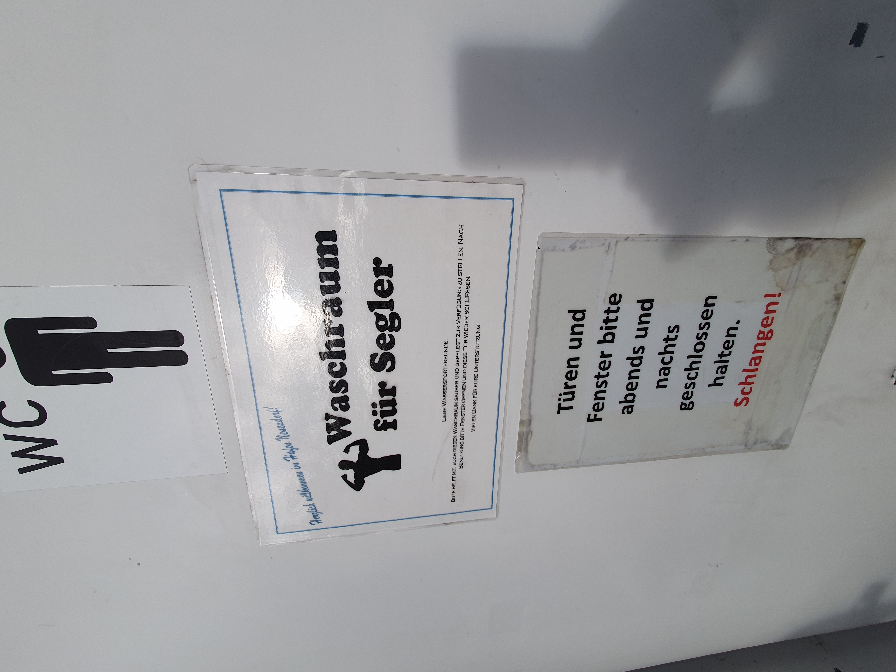
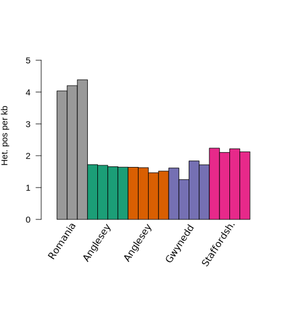
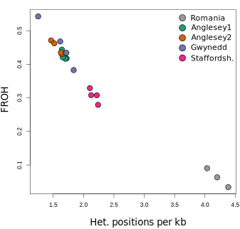

```{r setup, include = FALSE}
library(knitr)
```

<!-- adding bold and italic options -->
<style>
em {
  font-style: italic
}
strong {
  font-weight: bold;
}
</style>

## Conservation Genomics at Bangor

```{r, out.width = "100%", dpi = 300, echo = FALSE, fig.align = "center", fig.cap=""}
   include_graphics("./assets/img/Bangor_rep_con.png")
```

--- bg:black

```{r, out.width = "100%", dpi = 300, echo = FALSE, fig.align = "center", fig.cap=""}
   include_graphics("./assets/img/adder_mitsi.JPG")
```

---

## Conservation Genomics of Adders

- Conservation genetics
- Adder!
- Adder conservation genomics

**Links to first year modules**

- Conservation
- Genetics
- Evolution
- Cell biology
- Herpetology

--- .segue .dark 

## Conservation genetics

---

## Genome diversity

```{r, out.width = "90%", dpi = 300, fig.align = "center", echo = FALSE, fig.cap=""}
include_graphics("./assets/img/het.svg")
```

---

## Loss of genetic diversity in small populations

```{r, out.width = "100%", dpi = 300, fig.align = "center", echo = FALSE, fig.cap=""}

```

- **Small** populations lose genetic diversity faster than it is replaced by mutation
- In **Isolated** populations variation cannot be replaced by gene flow
- Increased frequency of **inbreeding** (mating between close relatives)

---

## Reduced evolutionary potential

```{r, out.width = "100%", dpi = 300, fig.align = "center", echo = FALSE, fig.cap=""}
include_graphics("./assets/img/evol.svg")
```

- No variation = no evolution
- Unpredictable because we don't know the future precisely (disease, climate change, etc)

---

## Inbreeding depression

- Deleterious gene variants tend to be **recessive**
- **Heterozygous**, one healthy gene copy and one deleterious gene copy = OK
- **Homozygous**, both gene copies deleterious = genetic disease
- When genetic diversity is low, genes are more likely to be homozygous

```{r, out.width = "95%", dpi = 300, fig.align = "center", echo = FALSE, fig.cap=""}

```

--- &twocol

## Smygehuk adders

*** =left

- Population in Sweden
- Small populations size
- Isolated > 100 years
- low genetic diversity
- Population decline
- Many offspring deformed/stillborn

*** =right

```{r, out.width = "70%", dpi = 300, echo = FALSE, fig.align = "center", fig.cap=""}
  include_graphics("./assets/img/adder_female3.JPG")
```

```{r, out.width = "70%", dpi = 300, echo = FALSE, fig.align = "center", fig.cap=""}
  include_graphics("./assets/img/adder_male2.JPG")
```

--- &twocol

## Genetic rescue

*** =left

```{r, out.width = "100%", dpi = 300, echo = FALSE, fig.align = "center", fig.cap=""}
  include_graphics("./assets/img/adders.svg")
```

*** =right

- 20 males from other (large) populations released
- Left for 4 years
- Remaining 8 males returned to source population
- Dramatic increase in recruitment
- Increase in genetic diversity
- Reduction in stillborn offspring

---

## Smygehuk adders background reading

```{r mad, out.width = "100%", out.height=500, dpi = 300, echo = FALSE, fig.cap=""}
  include_graphics("./assets/img/Madsen_adders.pdf")
```

--- .segue .dark 

## Adder!

--- &twocol

## The adder, *Vipera berus*

*** =left

- UK's only venomous snake
- Family Viperidae, subfamily Viperinae
- Medium sized viper, 40-60 cm
- Diet: lizards, frogs and rodents
- Solenoglyphous dentition
- Live bearing, 8-12 neonates
- Variable colour/pattern

*** =right

```{r, out.width = "85%", dpi = 300, echo = FALSE, fig.align = "center", fig.cap=""}
  
```

---

## Geographic distribution

```{r, out.width = "100%", dpi = 300, echo = FALSE, fig.align = "center", fig.cap=""}
  include_graphics("./assets/img/mAP.svg")
```

--- bg:black

```{r, out.width = "90%", dpi = 300, echo = FALSE, fig.align = "center", fig.cap=""}
  include_graphics("./assets/img/male_rugen.jpg")
```

--- bg:black

```{r, out.width = "90%", dpi = 300, echo = FALSE, fig.align = "center", fig.cap=""}
  include_graphics("./assets/img/adder_female3.JPG")
```

--- bg:black

```{r, out.width = "90%", dpi = 300, echo = FALSE, fig.align = "center", fig.cap=""}
  include_graphics("./assets/img/melan_gwyn.jpg")
```

--- bg:black

```{r, out.width = "100%", dpi = 300, echo = FALSE, fig.align = "center", fig.cap=""}
  include_graphics("./assets/img/gp.jpg")
```

--- bg:black

```{r, out.width = "100%", dpi = 300, echo = FALSE, fig.align = "center", fig.cap=""}
  include_graphics("./assets/img/wb.jpg")
```

--- bg:black

```{r, out.width = "50%", dpi = 300, echo = FALSE, fig.align = "center", fig.cap=""}
  
```

--- bg:black

```{r, out.width = "50%", dpi = 300, echo = FALSE, fig.align = "center", fig.cap=""}
  include_graphics("./assets/img/boot.jpg")
```

--- bg:black

```{r, out.width = "100%", dpi = 300, echo = FALSE, fig.align = "center", fig.cap=""}
  include_graphics("./assets/img/rug.jpg")
```

--- bg:black

```{r, out.width = "90%", dpi = 300, echo = FALSE, fig.align = "center", fig.cap=""}
  include_graphics("./assets/img/mel_rug.jpg")
```

--- bg:black

```{r, out.width = "90%", dpi = 300, echo = FALSE, fig.align = "center", fig.cap=""}
  include_graphics("./assets/img/uni_rug.jpg")
```

--- bg:black

```{r, out.width = "100%", dpi = 300, echo = FALSE, fig.align = "center", fig.cap=""}
  
```

--- bg:black

```{r, out.width = "90%", dpi = 300, echo = FALSE, fig.align = "center", fig.cap=""}
  include_graphics("./assets/img/male_hid.jpg")
```

--- bg:black

```{r, out.width = "50%", dpi = 300, echo = FALSE, fig.align = "center", fig.cap=""}
  
```

--- bg:black

```{r, out.width = "50%", dpi = 300, echo = FALSE, fig.align = "center", fig.cap=""}
  include_graphics("./assets/img/car.jpg")
```

--- bg:black

```{r, out.width = "90%", dpi = 300, echo = FALSE, fig.align = "center", fig.cap=""}
  include_graphics("./assets/img/blackf.jpg")
```

--- bg:black

```{r, out.width = "90%", dpi = 300, echo = FALSE, fig.align = "center", fig.cap=""}
  include_graphics("./assets/img/hollenotter.jpg")
```

--- bg:black

```{r, out.width = "100%", dpi = 300, echo = FALSE, fig.align = "center", fig.cap=""}
  include_graphics("./assets/img/sara.jpg")
```

--- bg:black

```{r, out.width = "100%", dpi = 300, echo = FALSE, fig.align = "center", fig.cap=""}
  include_graphics("./assets/img/bos.jpg")
```

--- bg:black

```{r, out.width = "90%", dpi = 300, echo = FALSE, fig.align = "center", fig.cap=""}
  include_graphics("./assets/img/bostai.jpg")
```

---

## Not like a bee sting

```{r, out.width = "100%", out.height=500, dpi = 300, echo = FALSE, fig.cap=""}
  include_graphics("./assets/img/Warrell - 2005 - Treatment of bites by adders and exotic venomous snakes.pdf")
```

--- .segue .dark 

## Adder conservation genomics

---

## Conservation situation in UK

```{r gar, out.width = "100%", out.height=500, dpi = 300, echo = FALSE, fig.cap=""}
  include_graphics("./assets/img/Gardner et al. - 2019 - science survey of UK adders.pdf")
```

--- &thirds

## Research questions

*** =left

```{r, out.width = "100%", dpi = 300, fig.align = "center", echo = FALSE, fig.cap=""}
include_graphics("./assets/img/inbre.svg")
```

```{r, out.width = "100%", dpi = 300, fig.align = "center", echo = FALSE, fig.cap=""}
include_graphics("./assets/img/adder_mitsi.JPG")
```

*** =right

**How genetically diverse are UK adders?**

**Do they show signs of inbreeding?**

**How genetically isolated are adder populations?**

**What does this mean for adder conservation?**

---

## Genome sequencing

```{r, out.width = "90%", dpi = 300, fig.align = "center", echo = FALSE, fig.cap=""}
include_graphics("./assets/img/het.svg")
```

---

## Sampling

```{r, out.width = "75%", dpi = 300, fig.align = "center", echo = FALSE, fig.cap=""}
include_graphics("./assets/img/jtube.jpg")
```

--- &twocol

## Sampling

*** =left

```{r, out.width = "87%", dpi = 300, fig.align = "right", echo = FALSE, fig.cap=""}
include_graphics("./assets/img/meadow.png")
```

*** =right

```{r, out.width = "86%", dpi = 300, fig.align = "left", echo = FALSE, fig.cap=""}
include_graphics("./assets/img/skin_ce.jpg")
```

--- &twocol

## DNA sequencing and analysis

*** =left

```{r, out.width = "83%", dpi = 300, fig.align = "right", echo = FALSE, fig.cap=""}
include_graphics("./assets/img/dna_extract.jpg")
```

*** =right

```{r, out.width = "100%", dpi = 300, fig.align = "right", echo = FALSE, fig.cap=""}

```

---

## Adder genetic diversity

```{r, out.width = "90%", dpi = 300, fig.align = "center", echo = FALSE, fig.cap=""}
include_graphics("./assets/img/het.svg")
```

--- &twocol

## Genetic diversity: heterozygosity

*** =left

```{r, out.width = "100%", dpi = 300, fig.align = "center", echo = FALSE, fig.cap=""}
include_graphics("./assets/img/adder_map.svg")
```

*** =right

```{r, out.width = "100%", dpi = 300, fig.align = "center", echo = FALSE, fig.cap=""}

```

---

## Inbreeding: Runs of homozygosity (ROH)

```{r, out.width = "90%", dpi = 300, fig.align = "center", echo = FALSE, fig.cap=""}
include_graphics("./assets/img/recom_roh.svg")
```

---

## Inbreeding: Runs of homozygosity (ROH)

```{r, out.width = "90%", dpi = 300, fig.align = "center", echo = FALSE, fig.cap=""}
include_graphics("./assets/img/manhatt_1ind.svg")
```

---

## Inbreeding: Runs of homozygosity (ROH)

```{r, out.width = "90%", dpi = 300, fig.align = "center", echo = FALSE, fig.cap=""}
include_graphics("./assets/img/manhatt_3ind.svg")
```

---

## Diversity and inbreeding

```{r, out.width = "60%", dpi = 300, fig.align = "center", echo = FALSE, fig.cap=""}

```

--- bg:white

## Population isolation: migration surface

```{r, out.width = "70%", dpi = 300, fig.align = "center", echo = FALSE, fig.cap=""}
include_graphics("./assets/img/eems_grid.svg")
```

--- bg:white

## Population isolation: migration surface

```{r, out.width = "70%", dpi = 300, fig.align = "center", echo = FALSE, fig.cap=""}
include_graphics("./assets/img/eems_mig.svg")
```

--- &thirds

## Research questions

*** =left

```{r, out.width = "100%", dpi = 300, fig.align = "center", echo = FALSE, fig.cap=""}
include_graphics("./assets/img/inbre.svg")
```

```{r, out.width = "100%", dpi = 300, fig.align = "center", echo = FALSE, fig.cap=""}
include_graphics("./assets/img/adder_mitsi.JPG")
```

*** =right

**How genetically diverse are UK adders?**

- High diversity, indicates historically large population

**Do they show signs of inbreeding?**

- Yes, severe inbreeding detected

**How genetically isolated are adder populations?**

- High levels of isolation even at small spatial scales

**What does this mean for adder conservation?**

- We don't know yet
- More research to do!

--- &thankyou

## Thank You

**Hope you all adder nice day :)**
