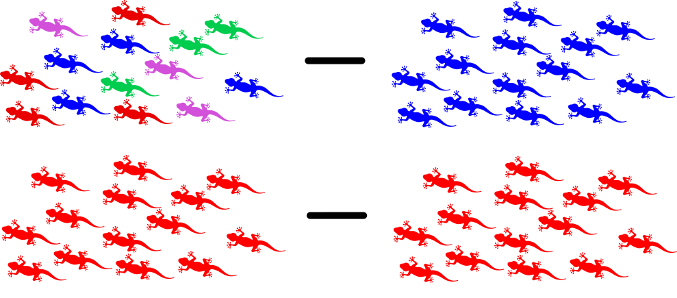
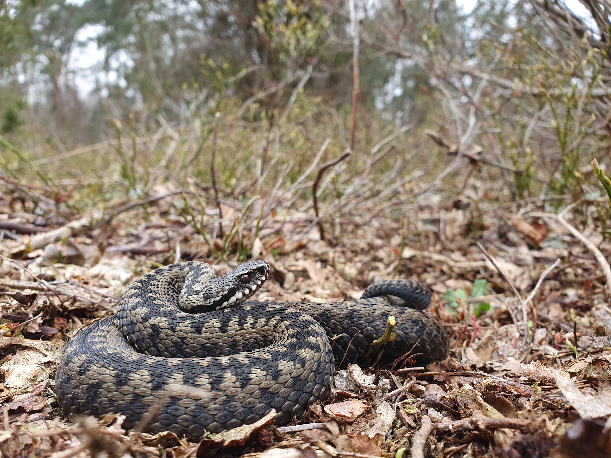
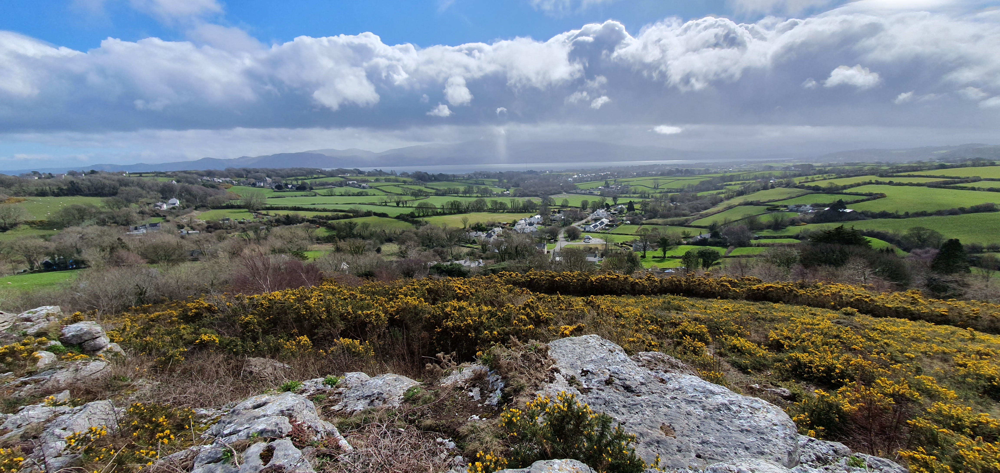
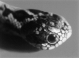
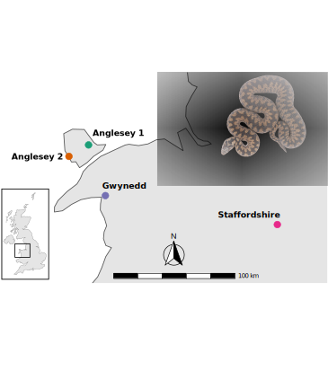
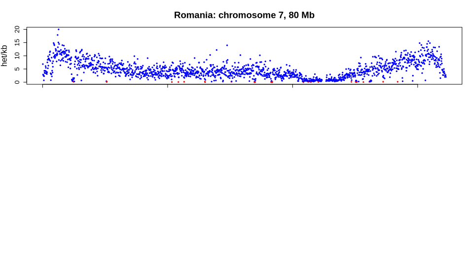
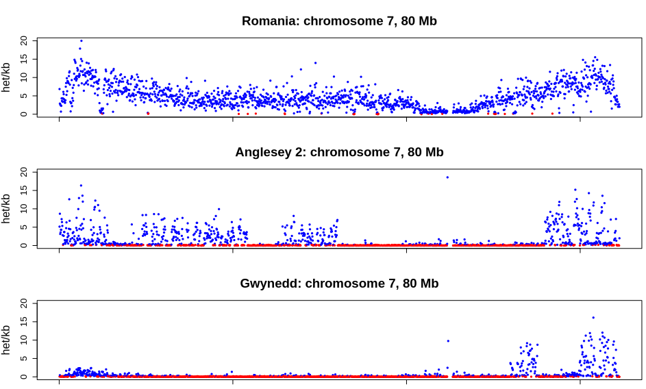

<!-- adding bold and italic options -->

## Conservation Genomics at Bangor

--- bg:black

---

## Conservation Genomics of Adders

- Conservation genetics
- Adder!
- Adder conservation genomics

**Links to first year modules**

- Conservation
- Genetics
- Evolution
- Cell biology
- Herpetology

--- .segue .dark 

## Conservation genetics

---

## Genome diversity

---

## Loss of genetic diversity

- **Small** populations lose genetic diversity faster than it is replaced by mutation
- In **Isolated** populations variation cannot be replaced by gene flow
- Net loss of genetic diversity

---

## Reduced evolutionary potential

- No variation = no evolution
- Unpredictable because we don't know the future precisely (disease, climate change, etc)

---

## Inbreeding depression

- Deleterious gene variants tend to be **recessive**
- **Heterozygous**, one healthy gene copy and one deleterious gene copy = OK
- **Homozygous**, both gene copies deleterious = genetic disease
- When genetic diversity is low, genes are more likely to be homozygous

--- &twocol

## Smygehuk adders

*** =left

- Population in Sweden
- Small populations size
- Isolated > 100 years
- low genetic diversity
- Population decline
- Many offspring deformed/stillborn

*** =right

--- &twocol

## Genetic rescue

*** =left

*** =right

- 20 males from other (large) populations released
- Left for 4 years
- Remaining 8 males returned to source population
- Dramatic increase in recruitment
- Increase in genetic diversity
- Reduction in stillborn offspring

---

## Smygehuk adders background reading

<embed src="./assets/img/Madsen_adders.pdf" width="100%" height="500" type="application/pdf" />

--- .segue .dark 

## The adder, *Vipera berus*

---

## Geographic distribution

--- bg:black

--- bg:black

--- bg:black

--- bg:black

--- bg:black

--- bg:black

--- bg:black

--- bg:black

--- bg:black

--- bg:black

--- bg:black

--- bg:black

--- bg:black

--- bg:black

--- bg:black

--- bg:black

--- bg:black

--- bg:black

--- bg:black

--- bg:black

---

## Diet

- lizards
- frogs
- rodents
- subdued with venom

---

## Not like a bee sting

<embed src="./assets/img/Warrell - 2005 - Treatment of bites by adders and exotic venomous snakes.pdf" width="100%" height="500" type="application/pdf" />

--- .segue .dark 

## Adder conservation genomics

---

## Conservation situation in UK

<embed src="./assets/img/Gardner et al. - 2019 - science survey of UK adders.pdf" width="100%" height="500" type="application/pdf" />

--- &thirds

## Research questions

*** =left

*** =right

**How genetically diverse are UK adders?**

**Do they show signs of inbreeding?**

**How genetically isolated are adder populations?**

**What does this mean for adder conservation?**

---

## Genome sequencing

---

## Sampling

--- &twocol

## Sampling

*** =left

*** =right

--- &twocol

## DNA sequencing and analysis

*** =left

*** =right

---

## Adder genetic diversity

--- &twocol

## Genetic diversity: heterozygosity

*** =left

*** =right

---

## Inbreeding: Runs of homozygosity (ROH)

---

## Inbreeding: Runs of homozygosity (ROH)

---

## Inbreeding: Runs of homozygosity (ROH)

---

## Diversity and inbreeding

--- bg:white

## Population isolation: migration surface

--- bg:white

## Population isolation: migration surface

--- &thirds

## Research questions

*** =left

*** =right

**How genetically diverse are UK adders?**

- High diversity, indicates historically large population

**Do they show signs of inbreeding?**

- Yes, severe inbreeding detected

**How genetically isolated are adder populations?**

- High levels of isolation even at small spatial scales

**What does this mean for adder conservation?**

- We don't know yet
- More research to do!

--- &thankyou

## Thank You
